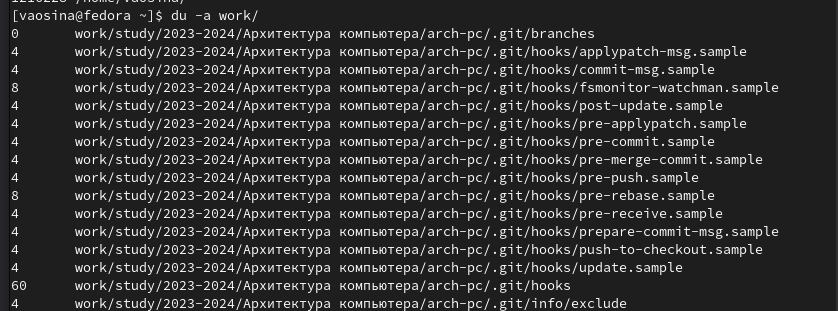

---
## Front matter
lang: ru-RU
title: Лабораторная работа №8
subtitle: Операционные системы
author:
  - Осина В.А.
institute:
  - Российский университет дружбы народов, Москва, Россия
date: 30 марта 2024 года

## i18n babel
babel-lang: russian
babel-otherlangs: english

## Formatting pdf
toc: false
toc-title: Содержание
slide_level: 2
aspectratio: 169
section-titles: true
theme: metropolis
header-includes:
 - \metroset{progressbar=frametitle,sectionpage=progressbar,numbering=fraction}
 - '\makeatletter'
 - '\beamer@ignorenonframefalse'
 - '\makeatother'
---

# Информация

## Докладчик

:::::::::::::: {.columns align=center}
::: {.column width="70%"}

  * Осина Виктория Александровна 
  * студентка группа НКАбд-04-23
  * Российский университет дружбы народов
  * [1132236006@pfur.ru](mailto:1132236006@pfur.ru)
  * <https://github.com/urocean>

:::
::: {.column width="30%"}

:::
::::::::::::::

# Вводная часть

## Актуальность

- Важно уметь работать с консолью
- Знание нужных команд упростит работу с файлами

## Объект и предмет исследования

- Терминал
- Команды для терминала

## Цели и задачи

- Ознакомление с инструментами поиска файлов и фильтрации текстовых данных
- Приобретение навыков по управлению процессами и проверке использования диска и обслуживанию файловых систем

## Материалы и методы

- Терминал Linux

# Ход лабораторной работы

## Перенаправление элементов в файл

Записываю в файл file.txt названия файлов, содержащихся в каталоге /etc, при помощи перенаправления ">", чтобы создать файл file.txt. Затем дописываю в этот же файл названия файлов, содержащихся в моём домашнем каталоге, используя перенаправление ">>". Записываю имена всех файлов из file.txt, имеющих расширение .conf, в новый текстовой файл conf.txt и при помощи команды head вывожу первые 10 имен для проверки.

{#fig:003 width=70%}

## Поиск файла и фильтрация текста 

Определяю, какие файлы в моём домашнем каталоге имеют имена, начинающиеся с символа c. Вывожу на экран (по странично) имена файлов из каталога /etc, начинающиеся с символа h.

{#fig:006 width=70%}

## Управление задачами и процессами, 

Запускаю в фоновом режиме процесс, который будет записывать в файл ~/logfile файлы, имена которых начинаются с log. Удаляю файл ~/logfile. Запускаю из консоли в фоновом режиме редактор gedit. Использую команду kill для завершения процесса gedit.

{#fig:022 width=70%}

{#fig:013 width=70%}

## Получение информации о процессах

Определяю идентификатор процесса gedit, используя команду ps, конвейер и фильтр grep.

{#fig:009 width=70%}

## Проверка использования диска

Выполняю команду df и du 

{#fig:017 width=70%}

{#fig:018 width=70%}

# Результаты

Благодаря данной лабораторной работе я ознакомилась с инструментами поиска файлов и фильтрации текстовых данныхм приобрела практические навыки: по управлению процессами (и заданиями), по проверке использования диска и обслуживанию файловых систем.

# Список литературы 

::: {https://esystem.rudn.ru/pluginfile.php/2288089/mod_resource/content/4/006-lab_proc.pdf} :::

