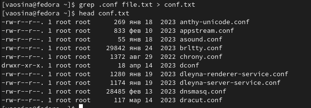

---
## Front matter
title: "Отчет по выполнению лабораторной работы №8"
subtitle: "Операционные системы"
author: "Осина Виктория Александровна"

## Generic otions
lang: ru-RU
toc-title: "Содержание"

## Bibliography
bibliography: bib/cite.bib
csl: pandoc/csl/gost-r-7-0-5-2008-numeric.csl

## Pdf output format
toc: true # Table of contents
toc-depth: 2
lof: true # List of figures
lot: true # List of tables
fontsize: 12pt
linestretch: 1.5
papersize: a4
documentclass: scrreprt
## I18n polyglossia
polyglossia-lang:
  name: russian
  options:
	- spelling=modern
	- babelshorthands=true
polyglossia-otherlangs:
  name: english
## I18n babel
babel-lang: russian
babel-otherlangs: english
## Fonts
mainfont: PT Serif
romanfont: PT Serif
sansfont: PT Sans
monofont: PT Mono
mainfontoptions: Ligatures=TeX
romanfontoptions: Ligatures=TeX
sansfontoptions: Ligatures=TeX,Scale=MatchLowercase
monofontoptions: Scale=MatchLowercase,Scale=0.9
## Biblatex
biblatex: true
biblio-style: "gost-numeric"
biblatexoptions:
  - parentracker=true
  - backend=biber
  - hyperref=auto
  - language=auto
  - autolang=other*
  - citestyle=gost-numeric
## Pandoc-crossref LaTeX customization
figureTitle: "Рис."
tableTitle: "Таблица"
listingTitle: "Листинг"
lofTitle: "Список иллюстраций"
lotTitle: "Список таблиц"
lolTitle: "Листинги"
## Misc options
indent: true
header-includes:
  - \usepackage{indentfirst}
  - \usepackage{float} # keep figures where there are in the text
  - \floatplacement{figure}{H} # keep figures where there are in the text
---

# Цель работы

Целью данной лабораторной работы является ознакомление с инструментами поиска файлов и фильтрации текстовых данных, а также приобретение практических навыков: по управлению процессами (и заданиями), по
проверке использования диска и обслуживанию файловых систем.

# Задание

1. Осуществите вход в систему, используя соответствующее имя пользователя.
2. Запишите в файл file.txt названия файлов, содержащихся в каталоге /etc. Допи-
шите в этот же файл названия файлов, содержащихся в вашем домашнем каталоге.
3. Выведите имена всех файлов из file.txt, имеющих расширение .conf, после чего
запишите их в новый текстовой файл conf.txt.
4. Определите, какие файлы в вашем домашнем каталоге имеют имена, начинавшиеся
с символа c? Предложите несколько вариантов, как это сделать.
5. Выведите на экран (по странично) имена файлов из каталога /etc, начинающиеся
с символа h.
6. Запустите в фоновом режиме процесс, который будет записывать в файл ~/logfile
файлы, имена которых начинаются с log.
7. Удалите файл ~/logfile.
8. Запустите из консоли в фоновом режиме редактор gedit.
9. Определите идентификатор процесса gedit, используя команду ps, конвейер и фильтр
grep. Как ещё можно определить идентификатор процесса?
10. Прочтите справку (man) команды kill, после чего используйте её для завершения
процесса gedit.
11. Выполните команды df и du, предварительно получив более подробную информацию
об этих командах, с помощью команды man.
12. Воспользовавшись справкой команды find, выведите имена всех директорий, имею-
щихся в вашем домашнем каталоге.

# Теоретическое введение

## Перенаправление ввода-вывода

В системе по умолчанию открыто три специальных потока:
– stdin — стандартный поток ввода (по умолчанию: клавиатура), файловый дескриптор
0;
– stdout — стандартный поток вывода (по умолчанию: консоль), файловый дескриптор
1;
– stderr — стандартный поток вывод сообщений об ошибках (по умолчанию: консоль),
файловый дескриптор 2.
Большинство используемых в консоли команд и программ записывают результаты
своей работы в стандартный поток вывода stdout. Например, команда ls выводит в стан-
дартный поток вывода (консоль) список файлов в текущей директории. Потоки вывода
и ввода можно перенаправлять на другие файлы или устройства. Проще всего это делается
с помощью символов >, >>, <, <<.

## Конвейер

Конвейер (pipe) служит для объединения простых команд или утилит в цепочки, в ко-
торых результат работы предыдущей команды передаётся последующей. Синтаксис
следующий:

`команда 1 | команда 2`

это означает, что вывод команды 1 передастся на ввод команде 2

## Поиск файла

Команда find используется для поиска и отображения на экран имён файлов, соответ-
ствующих заданной строке символов.
Формат команды:

`find путь [-опции]`

Путь определяет каталог, начиная с которого по всем подкаталогам будет вестись
поиск.

## Фильтрация текста

Найти в текстовом файле указанную строку символов позволяет команда grep.
Формат команды:

`grep строка имя_файла`

Кроме того, команда grep способна обрабатывать стандартный вывод других команд
(любой текст). Для этого следует использовать конвейер, связав вывод команды с вводом
grep.

## Проверка использования диска

Команда df показывает размер каждого смонтированного раздела диска.
Формат команды:

`df [-опции] [файловая_система]`

Команда du показывает число килобайт, используемое каждым файлом или каталогом.
Формат команды:

`du [-опции] [имя_файла...]`

На afs можно посмотреть использованное пространство командой

`fs quota`

## Управление задачами

Любую выполняющуюся в консоли команду или внешнюю программу можно запустить
в фоновом режиме. Для этого следует в конце имени команды указать знак амперсанда
&. Например:

`gedit &`

Будет запущен текстовой редактор gedit в фоновом режиме. Консоль при этом не будет
заблокирована.
Запущенные фоном программы называются задачами (jobs). Ими можно управлять
с помощью команды jobs, которая выводит список запущенных в данный момент задач.
Для завершения задачи необходимо выполнить команду

`kill %номер задачи`

## Управление процессами

Любой команде, выполняемой в системе, присваивается идентификатор процесса
(process ID). Получить информацию о процессе и управлять им, пользуясь идентифи-
катором процесса, можно из любого окна командного интерпретатора.

## Получение информации о процессах

Команда ps используется для получения информации о процессах.
Формат команды:

`ps [-опции]`

Для получения информации о процессах, управляемых вами и запущенных (работаю-
щих или остановленных) на терминале необходимо использовать опцию aux.

`ps aux`

# Выполнение лабораторной работы

Вход в систему у меня уже был осуществлен, поэтому сразу приступаю к следующему заданию. Записываю в файл file.txt названия файлов, содержащихся в каталоге /etc, при помощи перенаправления ">", чтобы создать файл file.txt. (рис. @fig:001).

{#fig:001 width=70%}

Затем дописываю в этот же файл названия файлов, содержащихся в моём домашнем каталоге, используя перенаправление ">>". (рис. [-@fig:002]).

{#fig:002 width=70%}

Вывожу имена всех файлов из file.txt, имеющих расширение .conf, (рис. [-@fig:021]).

{#fig:021 width=70%}

Теперь записываю их в новый текстовой файл conf.txt и при помощи команды head вывожу первые 10 имен для проверки.(рис. [-@fig:003]).

{#fig:003 width=70%}

Определяю, какие файлы в моём домашнем каталоге имеют имена, начинающиеся
с символа c. (рис. [-@fig:004]).

{#fig:004 width=70%}

Ещё один вариант, с помощью которого можно определить имена файлов, начинающихся на с. (рис. [-@fig:005]).

{#fig:005 width=70%}

Вывожу на экран (по странично) имена файлов из каталога /etc, начинающиеся
с символа h. (рис. [-@fig:006]).

{#fig:006 width=70%}

Запускаю в фоновом режиме процесс, который будет записывать в файл ~/logfile
файлы, имена которых начинаются с log. (рис. [-@fig:007]).

{#fig:007 width=70%}

Удаляю файл ~/logfile. (рис. [-@fig:008]).

{#fig:008 width=70%}

Запускаю из консоли в фоновом режиме редактор gedit. (рис. [-@fig:022]).

{#fig:022 width=70%}

Определяю идентификатор процесса gedit, используя команду ps, конвейер и фильтр
grep. (рис. [-@fig:009]).

{#fig:009 width=70%}

Ещё один способ, при помощи которого можно определить идентификатор. (рис. [-@fig:010]).

{#fig:010 width=70%}

Читаю справку (man) команды kill (рис. [-@fig:011]) и (рис. [-@fig:012]).

{#fig:011 width=70%}

{#fig:012 width=70%}

Использую команду kill для завершения процесса gedit. (рис. [-@fig:013]) и (рис. [-@fig:014]).

{#fig:013 width=70%}

{#fig:014 width=70%}

Читаю справку команды df. (рис. [-@fig:015]).

{#fig:015 width=70%}

Читаю справку команды du. (рис. [-@fig:016]).

{#fig:016 width=70%}

Выполняю команду df. (рис. [-@fig:017]).

{#fig:017 width=70%}

Выполняю команду du. (рис. [-@fig:018]).

{#fig:018 width=70%}

Читаю справку команды find. (рис. [-@fig:019]).

{#fig:019 width=70%}

Вводу имена всех директорий, имеющихся в моём домашнем каталоге. (рис. [-@fig:020]).

{#fig:020 width=70%}

# Выводы

Благодаря данной лабораторной работе я ознакомилась с инструментами поиска файлов и фильтрации текстовых данныхм приобрела практические навыки: по управлению процессами (и заданиями), по
проверке использования диска и обслуживанию файловых систем.

# Список литературы{.unnumbered}

::: {https://esystem.rudn.ru/pluginfile.php/2288089/mod_resource/content/4/006-lab_proc.pdf}
:::
