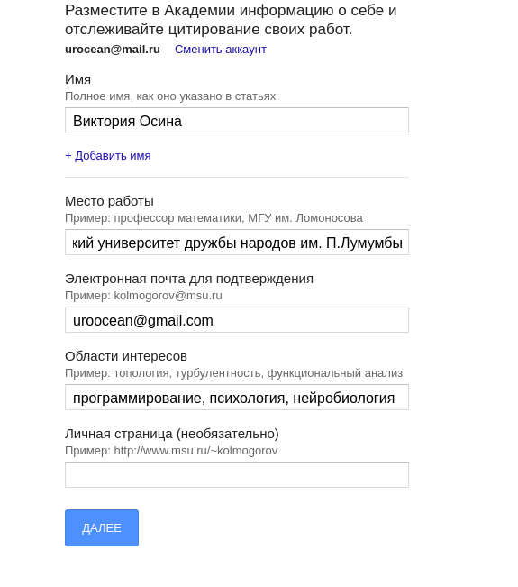
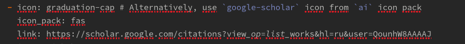
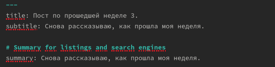
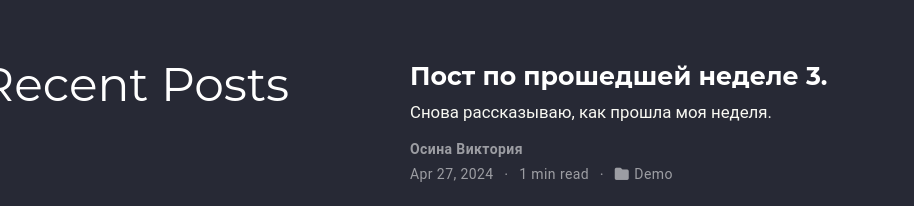

---
## Front matter
lang: ru-RU
title: Этап 4 индивидуального проекта 
subtitle: Операционные системы
author:
  - Осина В.А.
institute:
  - Российский университет дружбы народов, Москва, Россия
date: 27 апреля 2024 года

## i18n babel
babel-lang: russian
babel-otherlangs: english

## Formatting pdf
toc: false
toc-title: Содержание
slide_level: 2
aspectratio: 169
section-titles: true
theme: metropolis
header-includes:
 - \metroset{progressbar=frametitle,sectionpage=progressbar,numbering=fraction}
 - '\makeatletter'
 - '\beamer@ignorenonframefalse'
 - '\makeatother'
---

# Информация

## Докладчик

:::::::::::::: {.columns align=center}
::: {.column width="70%"}

  * Осина Виктория Александровна 
  * студентка группы НКАбд-04-23
  * Российский университет дружбы народов
  * [1132236006@pfur.ru](mailto:1132236006@pfur.ru)
  * <https://github.com/urocean>

:::
::: {.column width="30%"}

:::
::::::::::::::

# Вводная часть

## Актуальность

- Важно уметь регистрироваться на сайтах

## Объект и предмет исследования

- научный сайты
- посты 

## Цели и задачи

- Зарегистрироваться на сайтах
- Написать посты

## Материалы и методы

- Терминал Linux

# Ход выполнения этапа

## Регистрация

Подобным образом регистрируюсь на всех нужных сайтах.(рис. [-@fig:003]).

{#fig:003 width=70%}

{#fig:004 width=70%}

## Добавление ссылок 

{#fig:005 width=70%}

## Создание поста

Создаю пост по прошедшей неделе. (рис. [-@fig:018]).

{#fig:018 width=70%}

Пост размещен на сайте. (рис. [-@fig:019]).

{#fig:019 width=70%}

# Результаты

Я зарегистрировалась на научных сайтах

