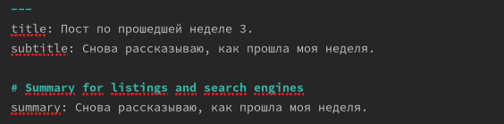

---
## Front matter
title: "Отчет по выполнению 4 этапа индивидуального проекта"
subtitle: "Операционные системы"
author: "Осина Виктория Александровна"

## Generic otions
lang: ru-RU
toc-title: "Содержание"

## Bibliography
bibliography: bib/cite.bib
csl: pandoc/csl/gost-r-7-0-5-2008-numeric.csl

## Pdf output format
toc: true # Table of contents
toc-depth: 2
lof: true # List of figures
lot: true # List of tables
fontsize: 12pt
linestretch: 1.5
papersize: a4
documentclass: scrreprt
## I18n polyglossia
polyglossia-lang:
  name: russian
  options:
	- spelling=modern
	- babelshorthands=true
polyglossia-otherlangs:
  name: english
## I18n babel
babel-lang: russian
babel-otherlangs: english
## Fonts
mainfont: PT Serif
romanfont: PT Serif
sansfont: PT Sans
monofont: PT Mono
mainfontoptions: Ligatures=TeX
romanfontoptions: Ligatures=TeX
sansfontoptions: Ligatures=TeX,Scale=MatchLowercase
monofontoptions: Scale=MatchLowercase,Scale=0.9
## Biblatex
biblatex: true
biblio-style: "gost-numeric"
biblatexoptions:
  - parentracker=true
  - backend=biber
  - hyperref=auto
  - language=auto
  - autolang=other*
  - citestyle=gost-numeric
## Pandoc-crossref LaTeX customization
figureTitle: "Рис."
tableTitle: "Таблица"
listingTitle: "Листинг"
lofTitle: "Список иллюстраций"
lotTitle: "Список таблиц"
lolTitle: "Листинги"
## Misc options
indent: true
header-includes:
  - \usepackage{indentfirst}
  - \usepackage{float} # keep figures where there are in the text
  - \floatplacement{figure}{H} # keep figures where there are in the text
---

# Задание

1. Зарегистрироваться на сайтах
2. Создать пост по прошлой неделе
3. Создать пост по теме по выбору

# Выполнение этапа

Регистрируюсь на сайте электронной библиотеки и добавляю в файл index.md ссылку на свой профиль. (рис. [-@fig:002]).

{#fig:002 width=70%}

Регистрируюсь на Google Scholar и добавляю в файл index.md ссылку на свой профиль.(рис. [-@fig:003]).

{#fig:003 width=70%}

{#fig:004 width=70%}

{#fig:005 width=70%}

Регистрируюсь на Orcid и добавляю в файл index.md ссылку на свой профиль. (рис. [-@fig:006]).

{#fig:006 width=70%}

{#fig:007 width=70%}

Регистрируюсь на Mendeley и добавляю в файл index.md ссылку на свой профиль.. (рис. [-@fig:008]).

{#fig:008 width=70%}

![Добавление ссылки]](image/9.png){#fig:009 width=70%}

Регистрируюсь на ResearchGate и добавляю в файл index.md ссылку на свой профиль.(рис. [-@fig:010]).

{#fig:010 width=70%}

{#fig:011 width=70%}

Регистрируюсь на Academia и добавляю в файл index.md ссылку на свой профиль. (рис. [-@fig:013]) и (рис. [-@fig:014]).

{#fig:013 width=70%}

![Добавление ссылки]](image/14.png){#fig:014 width=70%}

Профиль на гитхабе уже создае. (рис. [-@fig:016]).

{#fig:016 width=70%}

{#fig:017 width=70%}

Создаю пост по прошедшей неделе. (рис. [-@fig:018]).

{#fig:018 width=70%}

Пост размещен на сайте. (рис. [-@fig:019]).

{#fig:019 width=70%}

# Выводы

Я научилась регистрироваться на странных сайтах

