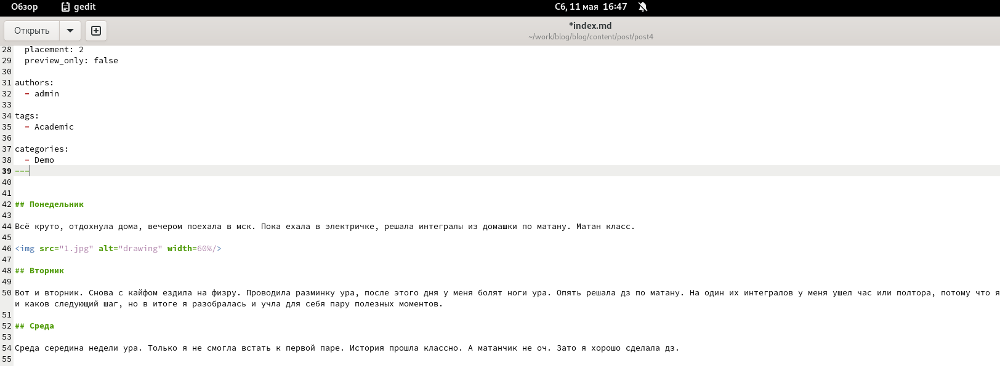

---
## Front matter
lang: ru-RU
title: Этап 5 индивидуального проекта 
subtitle: Операционные системы
author:
  - Осина В.А.
institute:
  - Российский университет дружбы народов, Москва, Россия
date: 11 мая 2024 года

## i18n babel
babel-lang: russian
babel-otherlangs: english

## Formatting pdf
toc: false
toc-title: Содержание
slide_level: 2
aspectratio: 169
section-titles: true
theme: metropolis
header-includes:
 - \metroset{progressbar=frametitle,sectionpage=progressbar,numbering=fraction}
 - '\makeatletter'
 - '\beamer@ignorenonframefalse'
 - '\makeatother'
---

# Информация

## Докладчик

:::::::::::::: {.columns align=center}
::: {.column width="70%"}

  * Осина Виктория Александровна 
  * студентка группы НКАбд-04-23
  * Российский университет дружбы народов
  * [1132236006@pfur.ru](mailto:1132236006@pfur.ru)
  * <https://github.com/urocean>

:::
::: {.column width="30%"}

:::
::::::::::::::

# Вводная часть

## Актуальность

- Важно периодически добавлять новые посты.

## Объект и предмет исследования

- персональный сайт
- посты 
- языки научного программирования

## Цели и задачи

1. Сделать записи для персональных проектов.
2. Создать пост по прошлой неделе.
3. Создать пост по теме по выбору.

## Материалы и методы

- Терминал Linux

# Ход выполнения этапа

## Создание записей для персонального проекта 

В папке content/project/programming редактирую файл index.md и вписываю туда информацию о персональном проекте. (рис. [-@fig:001]) и (рис. [-@fig:002]).

{#fig:002 width=70%}

## Проверяю отображение на сайте.(рис. [-@fig:003]).

{#fig:003 width=70%}

## Создание поста о прошедшей неделе

В папке content/post/post4 добавляю фотографии и редактирую файл index.md и вписываю туда информацию о прошедшей неделе. (рис. [-@fig:004]) и (рис. [-@fig:005]).

{#fig:005 width=70%}

## Проверяю отображение на сайте. (рис. [-@fig:006]).

{#fig:006 width=70%}

## Создание поста о языках научного программирования

В папке content/post/post5 добавляю фотографии и редактирую файл index.md и вписываю туда информацию о языках научного программирования. (рис. [-@fig:007]) и (рис. [-@fig:008]).

{#fig:008 width=70%}

## Проверяю отображение на сайте. (рис. [-@fig:009]).

![Отображение на сайте]](image/9.png){#fig:009 width=70%}

# Результаты

Я создала новые посты.

