---
## Front matter
title: "Отчет о прохождении 1 этапа внешнего курса"
subtitle: "Введение"
author: "Осина Виктория Александровна, НКАбд-04-23"

## Generic otions
lang: ru-RU
toc-title: "Содержание"

## Bibliography
bibliography: bib/cite.bib
csl: pandoc/csl/gost-r-7-0-5-2008-numeric.csl

## Pdf output format
toc: true # Table of contents
toc-depth: 2
lof: true # List of figures
lot: true # List of tables
fontsize: 12pt
linestretch: 1.5
papersize: a4
documentclass: scrreprt
## I18n polyglossia
polyglossia-lang:
  name: russian
  options:
	- spelling=modern
	- babelshorthands=true
polyglossia-otherlangs:
  name: english
## I18n babel
babel-lang: russian
babel-otherlangs: english
## Fonts
mainfont: PT Serif
romanfont: PT Serif
sansfont: PT Sans
monofont: PT Mono
mainfontoptions: Ligatures=TeX
romanfontoptions: Ligatures=TeX
sansfontoptions: Ligatures=TeX,Scale=MatchLowercase
monofontoptions: Scale=MatchLowercase,Scale=0.9
## Biblatex
biblatex: true
biblio-style: "gost-numeric"
biblatexoptions:
  - parentracker=true
  - backend=biber
  - hyperref=auto
  - language=auto
  - autolang=other*
  - citestyle=gost-numeric
## Pandoc-crossref LaTeX customization
figureTitle: "Рис."
tableTitle: "Таблица"
listingTitle: "Листинг"
lofTitle: "Список иллюстраций"
lotTitle: "Список таблиц"
lolTitle: "Листинги"
## Misc options
indent: true
header-includes:
  - \usepackage{indentfirst}
  - \usepackage{float} # keep figures where there are in the text
  - \floatplacement{figure}{H} # keep figures where there are in the text
---

# Цель работы

Ознакомиться с функционалом операционной системы Linux.

# Задание

Просмотреть видеоматериалы и пройти тестовые задания.

# Теоретическое введение

Линукс - в части случаев GNU/Linux — семейство Unix-подобных операционных систем на базе ядра Linux, включающих тот или иной набор утилит и программ проекта GNU, и, возможно, другие компоненты. Как и ядро Linux, системы на его основе, как правило, создаются и распространяются в соответствии с моделью разработки свободного и открытого программного обеспечения. Linux-системы распространяются в основном бесплатно в виде различных дистрибутивов — в форме, готовой для установки и удобной для сопровождения и обновлений, — и имеющих свой набор системных и прикладных компонентов, как свободных, так и проприетарных. 

# Выполнение лабораторной работы

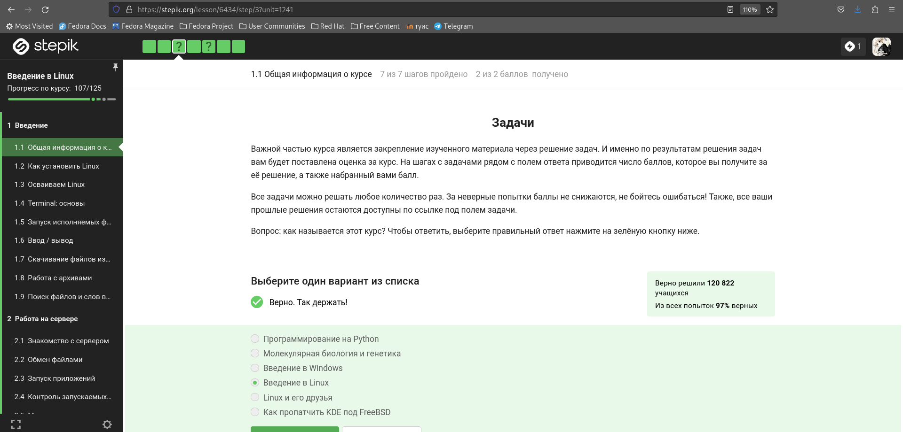{#fig:001 width=70%}

Курс называется "Введение в Linux".

{#fig:002 width=70%}

Прочитав критерии прохождения курса, я отметила необходимые утверждения.

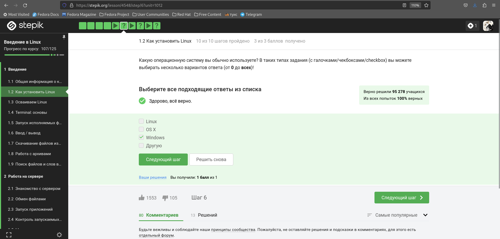{#fig:003 width=70%}

Я всегда пользовалась windows.

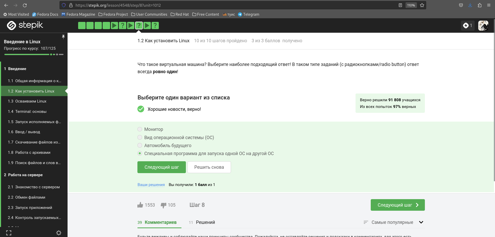{#fig:004 width=70%}

На моем компьютере установлен VirtualBox, что позволяет пользоваться одной операционной на другой.

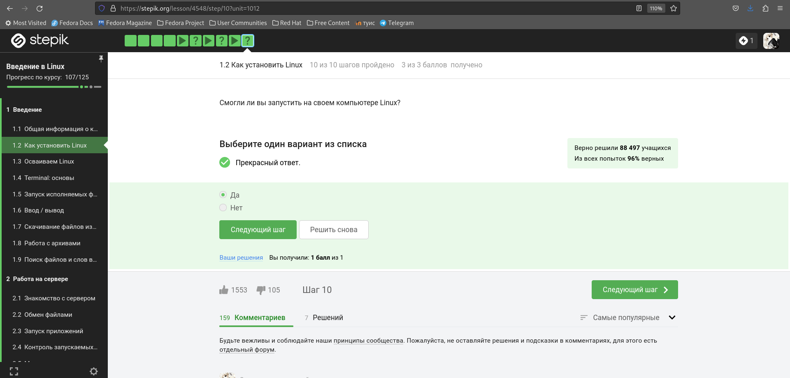{#fig:005 width=70%}

У меня получилось запустить Линукс.

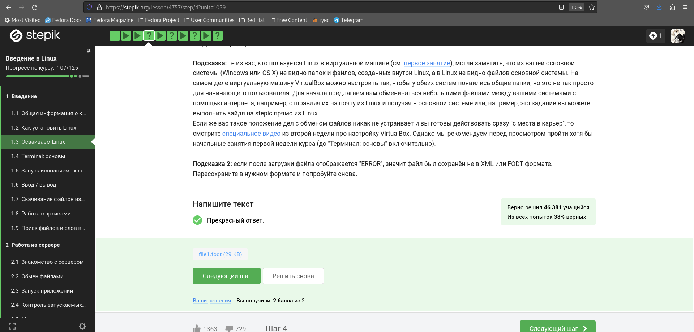{#fig:006 width=70%}

Я создала документ, и перед сохранением выбрала нужный формат, а после я его прикрепила к курсу. Прикрепленный файл видно на скриншоте.

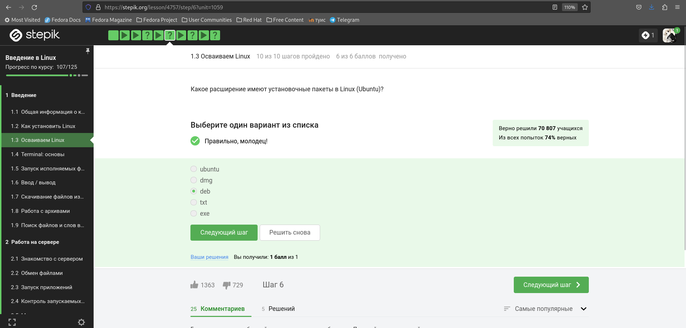{#fig:007 width=70%}

deb — формат пакетов операционных систем проекта Debian. Используется также их производными, такими как Ubuntu, Knoppix и другими.

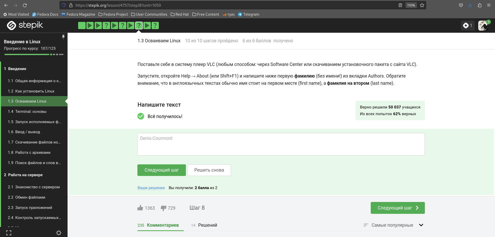{#fig:008 width=70%}

Я посмотрела, кто авторы программы и записала первую фамилию.

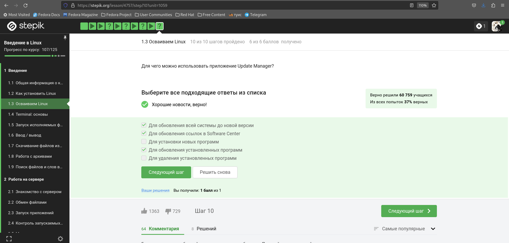{#fig:010 width=70%}

Менеджер обновлений — это программа для обновления установленного программного обеспечения в дистрибутивах ОС Linux, основанных на Debian или использующих систему управления пакетами APT. Менеджер обновлений устанавливает обновления безопасности или просто улучшающие функциональность программы.

{#fig:011 width=70%}

Ассоль - героиня литературного произведения, а термин - это определение.

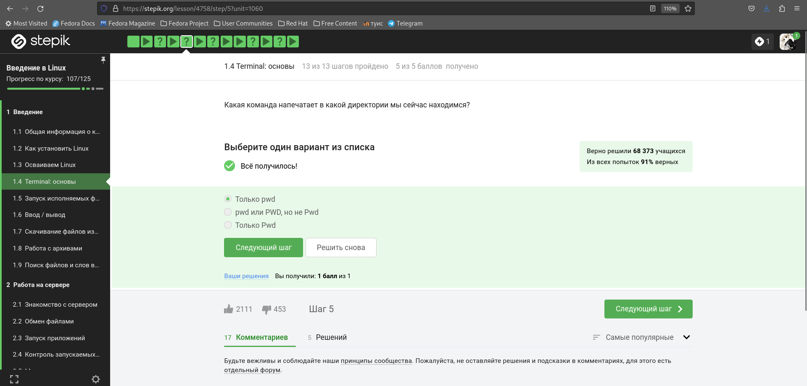{#fig:012 width=70%}

Интерфейс командной строки регистрозависим.

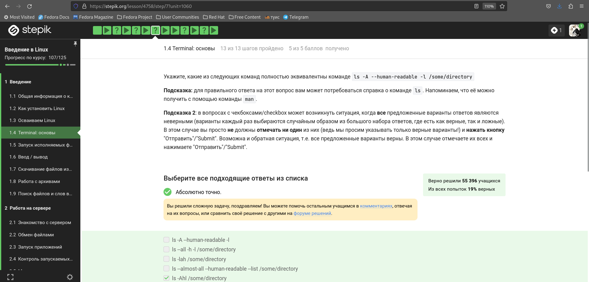{#fig:013 width=70%}

Интерфейс командной строки регистрозависим.

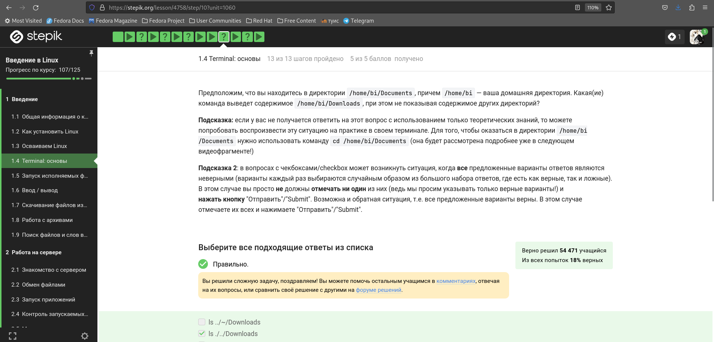{#fig:014 width=70%}

Прописываю полный путь до директории Downloads, так как на данный момент нахожусь в другой директории.

{#fig:015 width=70%}

rm -r удаление директории и рекуррентное удаление файлов, находящихся в ней.

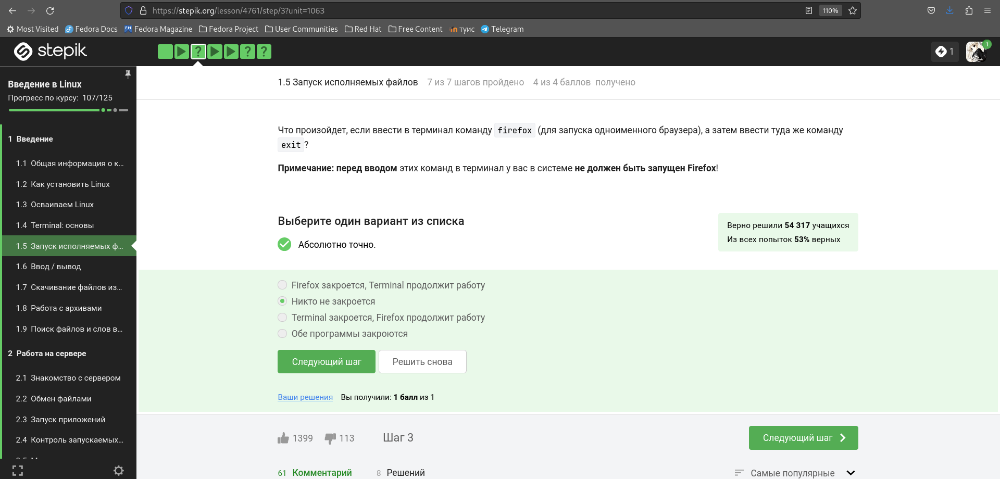{#fig:016 width=70%}

Это я проверила эмпирическим путём, что видно в ходе скринкаста.

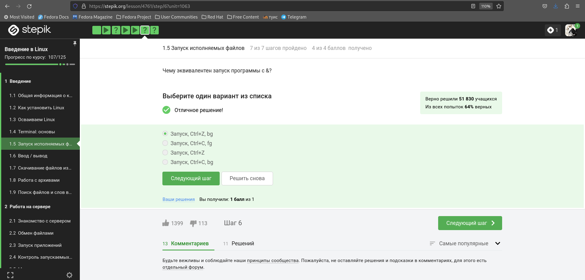{#fig:017 width=70%}

Запуск программы в фоновом режиме.

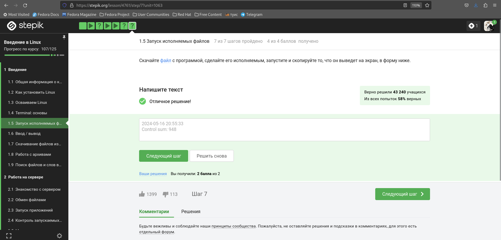{#fig:018 width=70%}

Здесь видно выполнение команды.

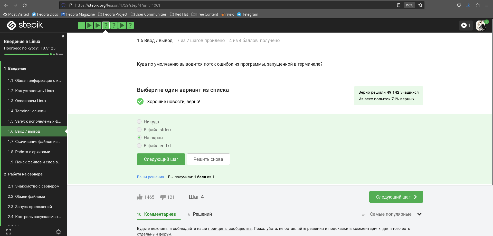{#fig:020 width=70%}

Автоматически поток ошибок выводится на экран - это видно, например, в ходе выполненных лабораторных. В файл будет поток выводиться, если его перенаправить.

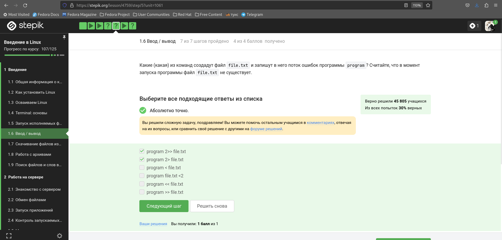{#fig:021 width=70%}

< file — использовать файл как источник данных для стандартного потока ввода.

> file — направить стандартный поток вывода в файл. Если файл не существует, он будет создан, если существует — перезаписан сверху.

2> file — направить стандартный поток ошибок в файл. Если файл не существует, он будет создан, если существует — перезаписан сверху.

>>file — направить стандартный поток вывода в файл. Если файл не существует, он будет создан, если существует — данные будут дописаны к нему в конец.

2>>file — направить стандартный поток ошибок в файл. Если файл не существует, он будет создан, если существует — данные будут дописаны к нему в конец.

&>file или >&file — направить стандартный поток вывода и стандартный поток ошибок в файл. Другая форма записи: >file 2>&1.

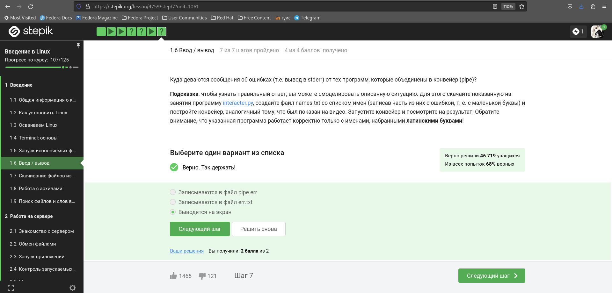{#fig:022 width=70%}

cat names.txt | ./interacter.py | less = вывод на экран

cat names.txt | ./interacter.py 2>err.txt | less = вывод ошибки в err.txt

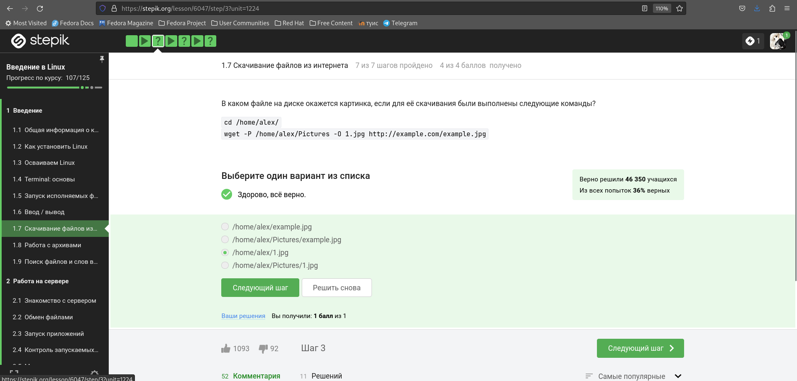{#fig:023 width=70%}

Команда wget -P /home/alex/Pictures http://example.com/example.jpg  скачивает файл и даже размещает его, назвав example.jpg, в папке /home/alex/Pictures. Но после этих манипуляций срабатывает часть ключа -O 1.jpg и только что скачаный example.jpg конвертируется в 1.jpg и размещается в текущей директории, в которой мы находимся, потому что путь файла уже не указан, указано только название - 1.jpg.

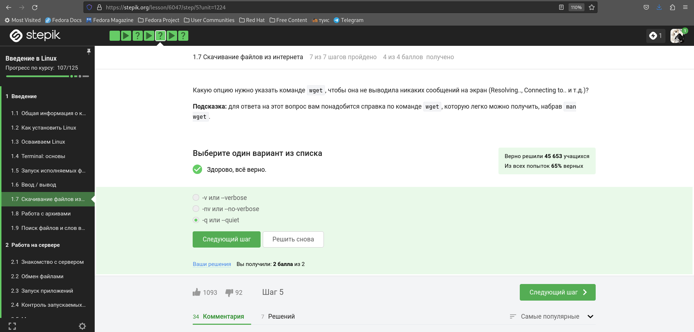{#fig:024 width=70%}

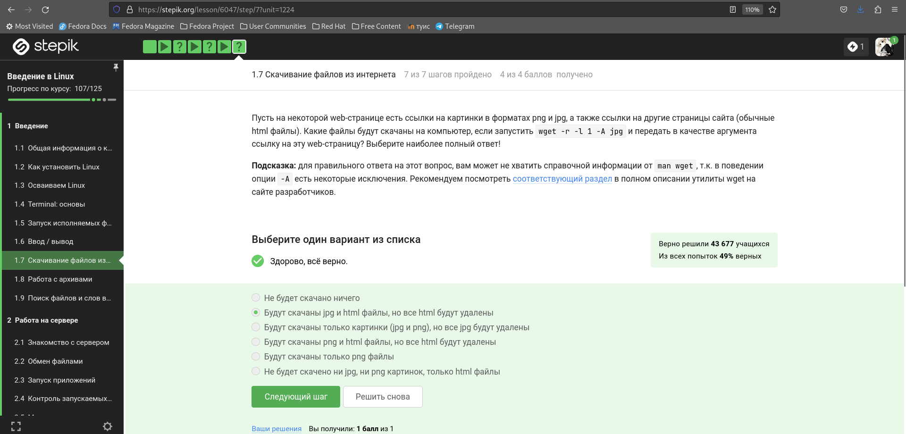{#fig:025 width=70%}

Указав 'wget -A gif,jpg', Wget загрузит только файлы, заканчивающиеся на 'gif' или 'jpg', то есть GIF и JPEG. С другой стороны, 'wget -A "zelazny*196[0-9]*" загрузит только файлы, начинающиеся с 'zelazny' и содержащие в себе числа от 1960 до 1969. Описание того, как работает сопоставление шаблонов, можно найти в руководстве к вашей оболочке.

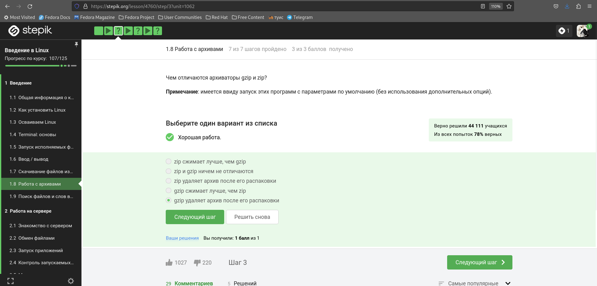{#fig:026 width=70%}

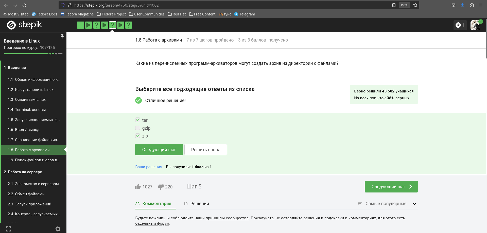{#fig:027 width=70%}

gzip — утилита сжатия и восстановления файлов, использующая алгоритм Deflate.

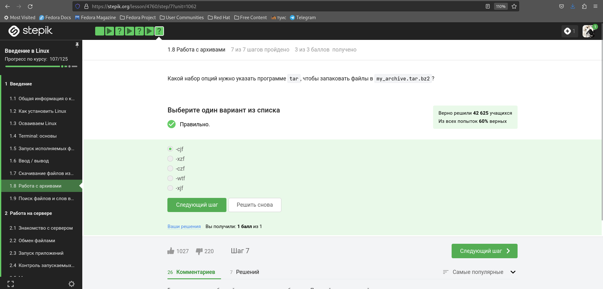{#fig:028 width=70%}

c - архиватор

j - указатель на тип архиватора bzip 

f - потому что создаем архив в файловой системе

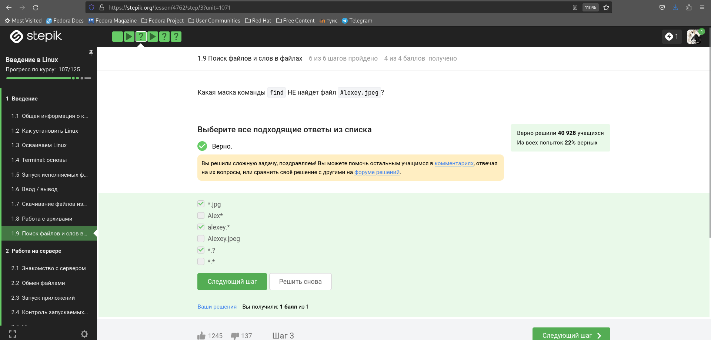{#fig:029 width=70%}

`?` = один символ

`alexey` = маленькая буква

И файл должен быть `jpeg`, а не `jpg`

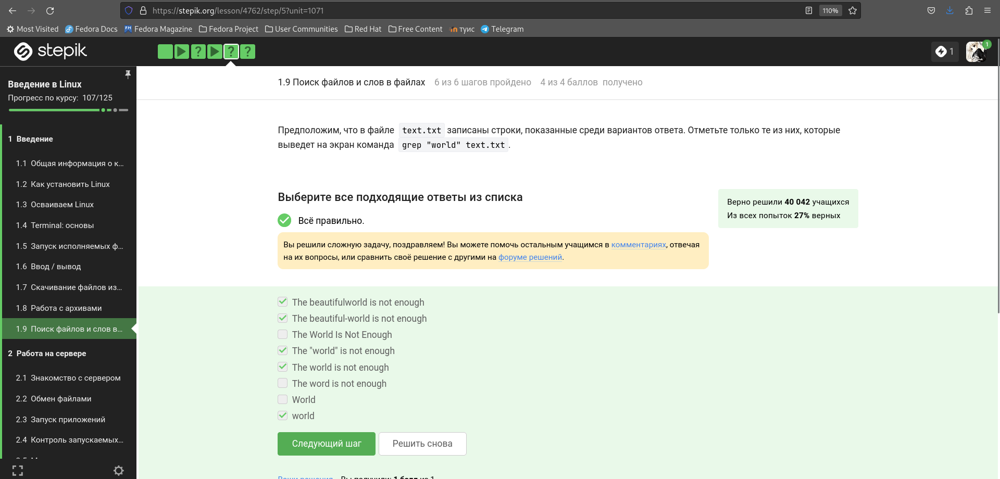{#fig:030 width=70%}

Регистр - маленькая буква, слово - `world`, а не `word`

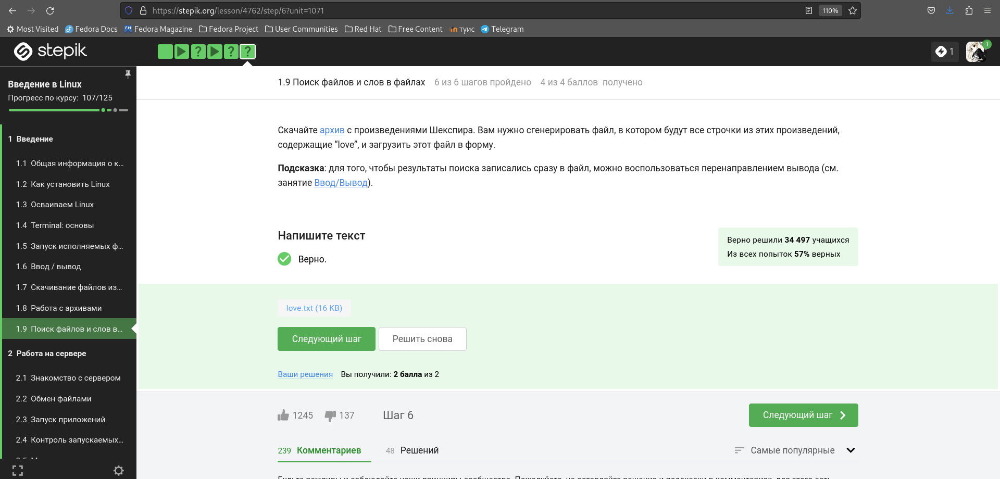{#fig:031 width=70%}

`grep -r "love" ~/Shakespeare/ > 1_m.txt`

# Выводы

Я вспомнила изученный ранее материал и узнала о некоторых новых полезных возможностях

# Список литературы{.unnumbered}

1. Введение в Linux

::: {#refs}
:::
